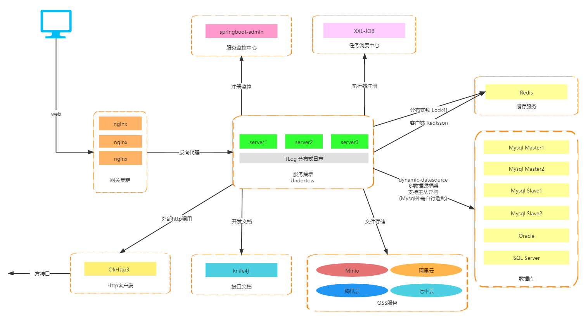

# 智能算法系统

---

> 【智能算法系统】是基于 **RuoYi-Vue-Plus** 框架所集成的软件系统，且该系统针对 `分布式集群` 场景有全方位升级以及更好的拓展支持

| 功能介绍 | 使用技术 | 文档地址 | 特性注意事项 |
|---|---|---|---|
| 当前框架 | RuoYi-Vue-Plus | [RuoYi-Vue-Plus文档](https://gitee.com/JavaLionLi/RuoYi-Vue-Plus/wikis/pages?_blank) | 重写RuoYi-Vue全方位升级(不兼容原框架) |
| satoken分支 | RuoYi-Vue-Plus-satoken | [satoken分支地址](https://gitee.com/JavaLionLi/RuoYi-Vue-Plus/tree/satoken/?_blank) | 高可读性 扩展性(推荐使用) |
| 单体分支 | RuoYi-Vue-Plus-fast | [fast分支地址](https://gitee.com/JavaLionLi/RuoYi-Vue-Plus/tree/fast/?_blank) | 单体应用结构 |
| Vue3分支 | RuoYi-Vue-Plus-UI | [UI地址](https://gitee.com/JavaLionLi/RuoYi-Vue-Plus-UI?_blank) | 由于组件还未完善 仅供学习 |
| 原框架 | RuoYi-Vue | [RuoYi-Vue官网](http://ruoyi.vip/?_blank) | 定期同步需要的功能 |
| 前端开发框架 | Vue、Element UI | [Element UI官网](https://element.eleme.cn/#/zh-CN?_blank) | |
| 后端开发框架 | SpringBoot | [SpringBoot官网](https://spring.io/projects/spring-boot/#learn?_blank) | |
| 容器框架 | Undertow | [Undertow官网](https://undertow.io/?_blank) | 基于 XNIO 的高性能容器 |
| 权限认证框架 | Spring Security、Jwt | [SpringSecurity官网](https://spring.io/projects/spring-security#learn?_blank) | 支持多终端认证系统 |
| 权限认证框架 | Sa-Token、Jwt | [Sa-Token官网](https://sa-token.dev33.cn/?_blank) | 强解耦、强扩展 |
| 关系数据库 | MySQL | [MySQL官网](https://dev.mysql.com/?_blank) | 适配 8.X 最低 5.7 |
| 缓存数据库 | Redis | [Redis官网](https://redis.io/?_blank) | 适配 6.X 最低 4.X |
| 数据库框架 | Mybatis-Plus | [Mybatis-Plus文档](https://baomidou.com/guide/?_blank) | 快速 CRUD 增加开发效率 |
| 数据库框架 | p6spy | [p6spy官网](https://p6spy.readthedocs.io/?_blank) | 更强劲的 SQL 分析 |
| 多数据源框架 | dynamic-datasource | [dynamic-ds文档](https://www.kancloud.cn/tracy5546/dynamic-datasource/content?_blank) | 支持主从与多种类数据库异构 |
| 序列化框架 | Jackson | [Jackson官网](https://github.com/FasterXML/jackson?_blank) | 统一使用 jackson 高效可靠 |
| Redis客户端 | Redisson | [Redisson文档](https://github.com/redisson/redisson/wiki/%E7%9B%AE%E5%BD%95?_blank) | 支持单机、集群配置 |
| 分布式限流 | Redisson | [Redisson文档](https://github.com/redisson/redisson/wiki/%E7%9B%AE%E5%BD%95?_blank) | 全局、请求IP、集群ID 多种限流 |
| 分布式锁 | Lock4j | [Lock4j官网](https://gitee.com/baomidou/lock4j?_blank) | 注解锁、工具锁 多种多样 |
| 分布式幂等 | Redisson | [Lock4j文档](https://gitee.com/baomidou/lock4j?_blank) | 拦截重复提交 |
| 分布式日志 | TLog | [TLog文档](https://yomahub.com/tlog/docs?_blank) | 支持跟踪链路日志记录、性能分析、链路排查 |
| 分布式任务调度 | Xxl-Job | [Xxl-Job官网](https://www.xuxueli.com/xxl-job/?_blank) | 高性能 高可靠 易扩展 |
| 文件存储 | Minio | [Minio文档](https://docs.min.io/?_blank) | 本地存储 |
| 文件存储 | 七牛、阿里、腾讯 | [OSS使用文档](https://gitee.com/JavaLionLi/RuoYi-Vue-Plus/wikis/pages?sort_id=4359146&doc_id=1469725?_blank) | 云存储 |
| 监控框架 | SpringBoot-Admin | [SpringBoot-Admin文档](https://codecentric.github.io/spring-boot-admin/current/?_blank) | 全方位服务监控 |
| 校验框架 | Validation | [Validation文档](https://docs.jboss.org/hibernate/stable/validator/reference/en-US/html_single/?_blank) | 增强接口安全性、严谨性 支持国际化 |
| Excel框架 | Alibaba EasyExcel | [EasyExcel文档](https://www.yuque.com/easyexcel/doc/easyexcel?_blank) | 性能优异 扩展性强 |
| 文档框架 | Knife4j | [Knife4j文档](https://doc.xiaominfo.com/knife4j/documentation/?_blank) | 美化接口文档 |
| 工具类框架 | Hutool、Lombok | [Hutool文档](https://www.hutool.cn/docs/?_blank) | 减少代码冗余 增加安全性 |
| 代码生成器 | 适配MP、Knife4j规范化代码 | [Hutool文档](https://www.hutool.cn/docs/?_blank) | 一键生成前后端代码 |
| 部署方式 | Docker | [Docker文档](https://docs.docker.com/?_blank) | 容器编排 一键部署业务集群 |
| 国际化 | SpringMessage | [SpringMVC文档](https://docs.spring.io/spring-framework/docs/current/reference/html/web.html#mvc?_blank) | Spring标准国际化方案 |

---

# 软件架构图

